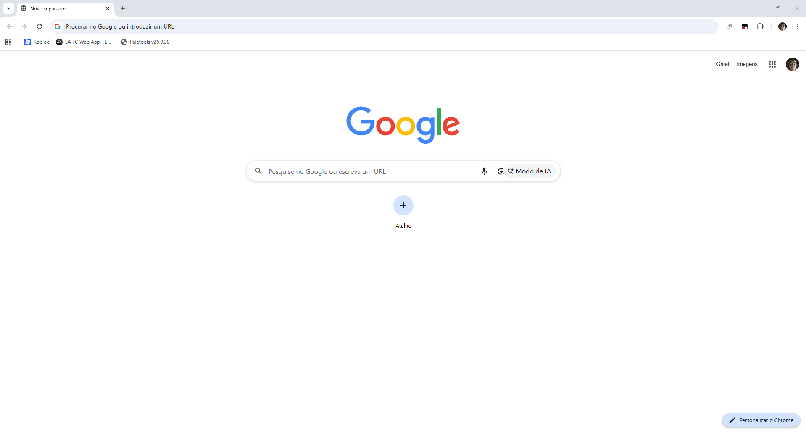
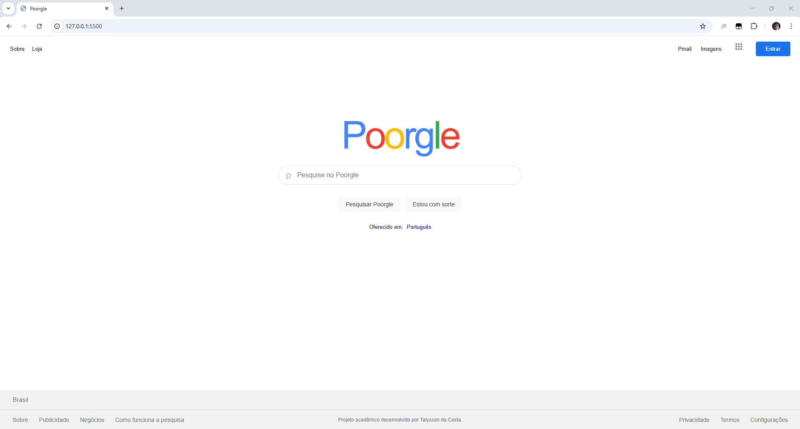

# TRABALHO G1 – FRONT -END

## Identificação

- **Disciplina:** Front-End
- **Trabalho:** Reconstrução de Página Web com HTML e CSS 
- **Integrante:** Talysson da Costa - RA: 1138376
- **Instituição:** Universidade Atitus
- **Professor:** Matheus Henrique Barquette

## Descrição do trabalho

O objetivo deste projeto é desenvolver uma página web utilizando HTML semântico e CSS, 
reproduzindo visualmente uma página de um site ou sistema real escolhido como referência.
 O trabalho busca aplicar, na prática, conceitos de estruturação e acessibilidade em HTML,
seletores e especificidade, box model, variáveis CSS, Flexbox, CSS Grid e responsividade 
com abordagem mobile first.

## Site referência

- **Página escolhida:** página inicial do Google.
- **Link:** [Google](https://www.google.com/)

## Comparação visual

<table>
	<tr>
		<th>Referência: Google</th>
		<th>Projeto: Poorgle</th>
	</tr>
	<tr>
		<td></td>
		<td></td>
	</tr>
</table>

## Tecnologias e conceitos

- HTML5 - estrutura semântica e acessível da página.
- CSS3 - estilização, seletores, cascata, especificidade, box model e variáveis CSS.
- Git - controle de versao e registro do processo de desenvolvimento, com commits distribuídos.

## Checklist

- [x] **1.1 Estrutura HTML semântica e acessível:** a página usa `header`, `nav`, `main`, `section` e `footer`. O formulário de busca tem `label` associado ao campo e envia a pesquisa ao Google. As capturas deste README têm textos alternativos descritivos; a página não usa imagens de conteúdo.
- [x] **1.2 Fidelidade visual à referência:** a organização geral do cabeçalho, busca e rodapé foi reproduzida; a marca Poorgle é uma adaptação própria.
- [x] **1.3 CSS: seletores, box model e variáveis:** o CSS usa seletores de classe, descendentes e pseudo-classes; `box-sizing: border-box` aplica o box model de forma consistente; custom properties em `:root` guardam cores reutilizadas com `var()`.
- [x] **1.4 Responsividade com Flexbox, Grid e mobile first:** os estilos-base atendem telas móveis e uma media query `min-width` adapta o layout para telas maiores. A página foi conferida em emulação a 375×812 e 1440×900, sem rolagem horizontal; no celular, o rodapé fica abaixo da primeira tela.
- [x] **1.5 Personalização e originalidade:** a página inclui o nome Poorgle e uma nota própria no rodapé: “Projeto acadêmico desenvolvido por Talysson da Costa.”